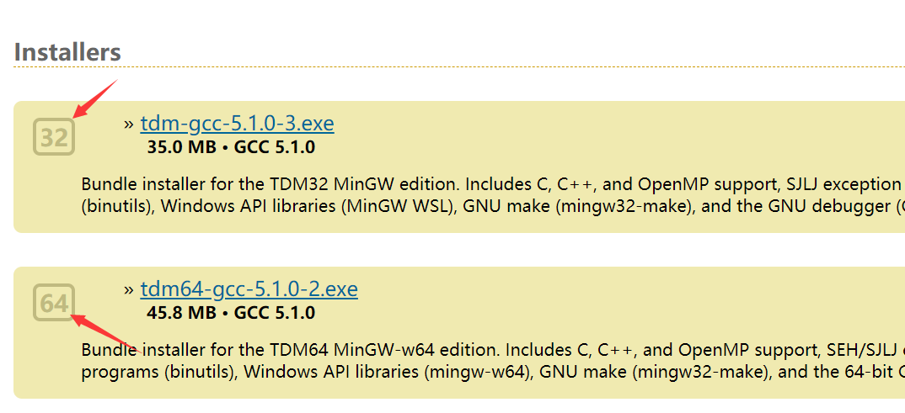

# 环境安装

### 第一步：安装编译器，推荐使用 GCC

官方下载地址（国内有的地区会比较卡，甚至无法打开）[TDM GCC](http://tdm-gcc.tdragon.net/download/) 

根据你的操作系统位数来选择下载哪一个，现在大多数都是 64 位操作系统了。由于 64 位系统也兼容 32 位程序，所以 64 位系统下 32 位也可以用。

#### 考虑到有很多人无法下载，帮大家下载了

**tdm gcc 32位** [tdm-gcc-5.1.0-3.exe](static/files/tdm-gcc-5.1.0-3.exe)

**tdm gcc 64位** [tdm64-gcc-5.1.0-2.exe](static/files/tdm64-gcc-5.1.0-2.exe)

#### 考虑到我提供的地址也可能会失效

1. 偷偷告诉大家，用手机 4g 网络分享热点让电脑连接去下载，也许可以打开官网。
2. 直接百度搜文件名，比如 `tdm64-gcc-5.1.0-2.exe` ，应该可以找到。
3. 如果还是找不到~ 那就在公众号 `点点学习网` 留言吧。

### 第二步：安装代码编辑器 VSCODE

官方下载地址 [VSCODE](https://code.visualstudio.com/)

### 第三步：安装插件(c/c++,code runner)

安装这两个插件的目的是不需要每次都手动敲编译命令。

**设置在控制台上运行代码** 文件>首选项>设置>用户>拓展>Run Code Configuration找到  `Run In Terminal`  打上勾

### 第四步：汉化（可选）

**具体操作可以看** [vscode汉化，设置为中文](https://dot2.com/t-55.html)

